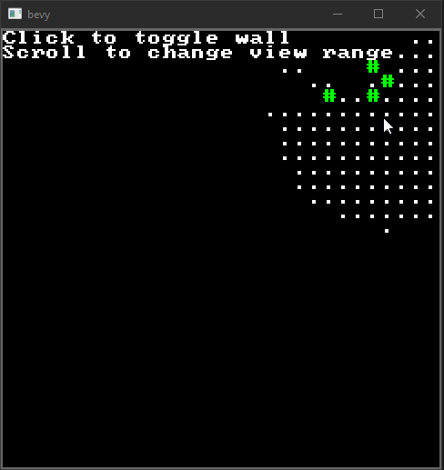

[](https://opensource.org/licenses/MIT)
[](https://crates.io/crates/adam_fov_rs)
[](https://docs.rs/adam_fov_rs/)

An implementation of [Adam Millazo's FOV algorithm](http://www.adammil.net/blog/v125_Roguelike_Vision_Algorithms.html#mine)



*Taken from the "terminal" example*

To use it you must implement the `VisibilityMap` trait on your map type. Then you can call `fov::compute` with your map
which will populate visible tiles based on the map's opaque tiles.

# Example
```rust
use adam_fov_rs::{VisibilityMap, fov};
use glam::IVec2;

struct Map {
    visible: Vec<Vec<bool>>,
    opaque: Vec<Vec<bool>>,
    size: IVec2,
}

impl VisibilityMap for Map {
    fn is_opaque(&self, p: IVec2) -> bool { self.opaque[p.x as usize][p.y as usize] }
    fn is_in_bounds(&self, p: IVec2) -> bool { p.cmpge(IVec2::ZERO).all() && p.cmplt(self.size).all() }
    fn set_visible(&mut self, p: IVec2) { self.visible[p.x as usize][p.y as usize] = true; }
    fn dist(&self, a: IVec2, b: IVec2) -> f32 { a.as_f32().distance(b.as_f32()) }
}

fn calc_fov(map: &mut Map, p: IVec2) {
    fov::compute(p, 5, map);
}
```